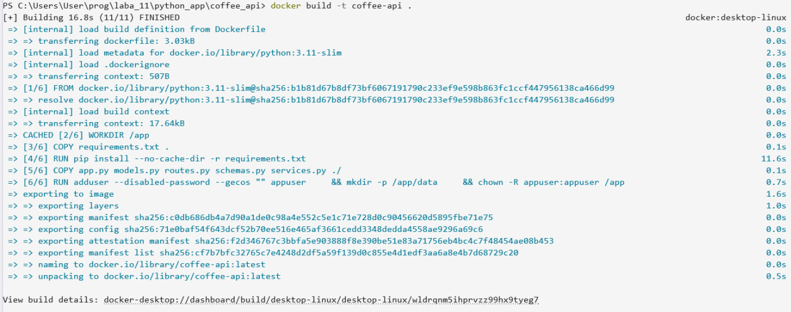
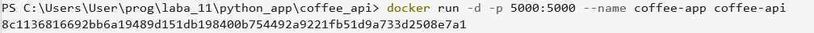

**Дисциплина:** Методы и технологии программирования  
**Выполнил:** Симбирева Анастасия Андреевна  
**Группа:** 220032-11  
**Лабораторная работа №11:** " Контейнеризация мультиязычных приложений"  
**Вариант:** 1  

### Практические задания

#### Средняя сложность
Задание 1. Написать Dockerfile для Python-приложения

В репозитории изначально был прикреплен готовый REST API для управления меню кофейни. Построен на Flask + SQLite, покрыт тестами, готов к запуску в Docker.

| Слой | Технология |
|---|---|
| Framework | Flask 3.x |
| База данных | SQLite (stdlib) |
| Валидация | Dataclasses + кастомные схемы |
| Тесты | pytest |
| Контейнер | Docker (python:3.11-slim) |

---
## Быстрый старт
### Локально
```bash
pip install -r requirements.txt
python app.py
```
### Docker
```bash
docker build -t coffee__api .

# Без сохранения данных
docker run -p 5000:5000 coffee__api

# С volume (БД сохраняется между перезапусками)
docker run -p 5000:5000 -v coffee_data:/app/data coffee__api
```
Скриншот выполнения:

Скриншот выполнения:

API доступен на `http://localhost:5000`.

---

## Переменные окружения

| Переменная | По умолчанию | Описание |
|---|---|---|
| `DATABASE_URL` | `/app/data/coffee.db` | Путь к файлу SQLite |

---

## Эндпоинты

| Метод | URL | Описание |
|---|---|---|
| `GET` | `/drinks/` | Список всех напитков (новые первые) |
| `POST` | `/drinks/` | Создать напиток |
| `PUT` | `/drinks/<id>` | Обновить цену и/или описание |
| `DELETE` | `/drinks/<id>` | Удалить напиток |

### Формат запроса

**POST /drinks/**
```json
{ "name": "Espresso", "price": 2.5, "description": "Short and strong" }
```
`description` — опционально.

**PUT /drinks/\<id\>**
```json
{ "price": 3.0 }
```
Достаточно одного поля: `price` и/или `description`.

### Формат ответа

```json
{
  "status": "success",
  "data": { "id": 1, "name": "Espresso", "price": 2.5, "description": null, "created_at": "...", "updated_at": "..." },
  "error": ""
}
```

При ошибке `status` = `"error"`, `data` = `{}`, `error` содержит сообщение.
---


Задание 3. Написать Dockerfile для Rust-приложения.

REST API для учёта посетителей кофейни. Написан на Rust с использованием `axum` и `SQLite`.

| Компонент | Технология |
|-----------|-----------|
| Веб-фреймворк | [axum](https://github.com/tokio-rs/axum) 0.7 |
| База данных | SQLite через [rusqlite](https://github.com/rusqlite/rusqlite) 0.31 (bundled) |
| Сериализация | [serde](https://serde.rs/) + serde_json |
| Async runtime | [tokio](https://tokio.rs/) |
| Контейнеризация | Docker (multi-stage build) |

## Локальный запуск
### Требования
- Rust 1.75+
- Cargo

### Запуск
```bash
cd coffee_users
cargo run
```
Сервер запустится на `http://0.0.0.0:3000`.

### Примеры запросов
```bash
# Добавить посетителя
curl -X POST http://localhost:3000/visitors \
  -H "Content-Type: application/json" \
  -d '{"name":"Анна","drink":"Латте"}'

# Получить всех посетителей
curl http://localhost:3000/visitors
```
---

## Тесты
```bash
# Все тесты (unit + integration)
cargo test
# Только unit-тесты модуля db
cargo test --lib
# Только интеграционные тесты API
cargo test --test api_test
```
Тесты используют изолированную in-memory БД — файловая система не затрагивается.

---

## Docker
### Сборка образа
```bash
docker build -t coffee_users .
```
Сборка двухэтапная: `rust:1.75-slim` для компиляции, `debian:bookworm-slim` для запуска. Зависимости кэшируются отдельным слоем — повторная сборка после изменения только кода занимает секунды.
### Запуск контейнера
```bash
# Без персистентности (БД живёт внутри контейнера)
docker run -d -p 3000:3000 --name coffee_users_container coffee_users
# С volume (БД сохраняется между перезапусками)
docker run -p 3000:3000 -v coffee_data:/app/data coffee_users
```
Скриншот выполнения:

### Переменные окружения
| Переменная | По умолчанию | Описание |
|------------|-------------|----------|
| `DATABASE_URL` | `/app/data/coffee_users.db` | Путь к файлу SQLite |

### Health check
Docker проверяет `GET /visitors` каждые 30 секунд (таймаут 3 с, 3 попытки, старт через 5 с после запуска):
```bash
docker inspect --format='{{.State.Health.Status}}' <container_id>
```